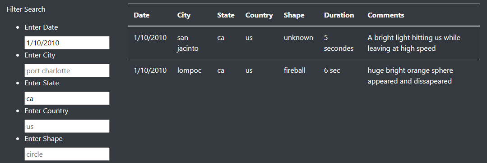
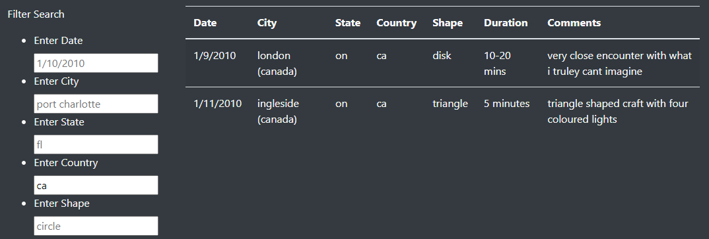
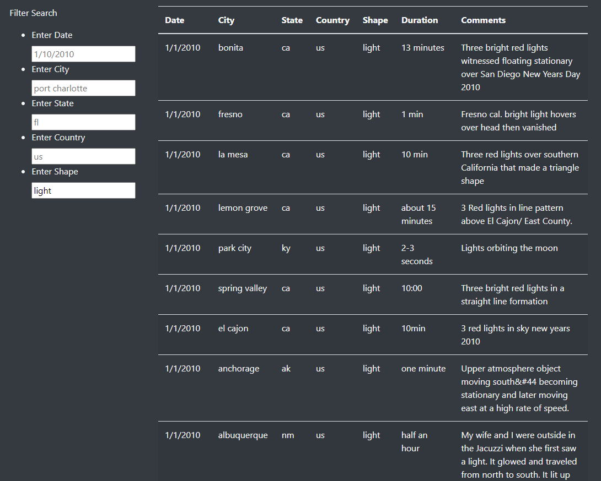

# UFO

[UFO Webpage](https://juliehock.github.io/UFO/)

## Overview of Project

The purpose of this analysis is to allows easy filtering of UFO data to a specific date, city, state, country or shape.  This will allow people to not have to sift through thousands of rows of data, but rather just look at the criteria they are ineterested in.  This will help people quickly find information, that might otherwise take hours to find.  

## Results

The website is very easy to use now, where anyone can visit the site and select how filtered they may want their data.  Below the introduction is the search filters, with the table to the right.  

A person filters, the table will automatically filter the data to meet the search.  A person could refine the search by one filter, up to all filters.  If there are no resutls based on the filters, the table will be blank.

So, if someone wanted to know about UFO sightings on 1/10/2010 in California, they would type in the date (using only a single digit for months and days if applicable) and then type in ca for the state.  We can see from the table that there were two resutls that matched that criteria.

If a person was more interested in searching a specific country, like Canada, they just need to type in ca for the country

Or if a person was more interested in the shape of the UFO, they could type in a decriptive word for the shape, like "light".

A person would be able to filter the data in as little or as many ways as they would like, which makes this website really cool.  

## Summary

This website will allow a person to quickly sort through a very large table to get certain information about UFO's that have been spotted.  While this is a really cool website and table, the drawback could be that when there is no data that is filterable, the table is just blank.  It would be better if a message popped up that said "No data fit these filters" so that people knew there was no data, and not that the website wasn't working.  In the shape filter, it may be better to have pre-selected shapes available for people to choose, so they know how they can filter the data.  Or allow people to filter through the comments column, if there are looking for something more specific.  
